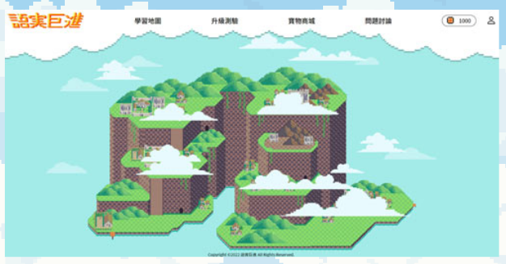
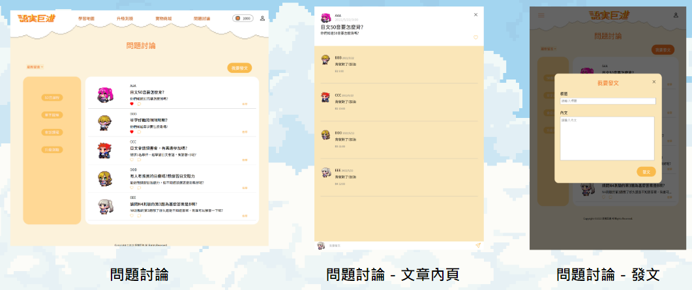
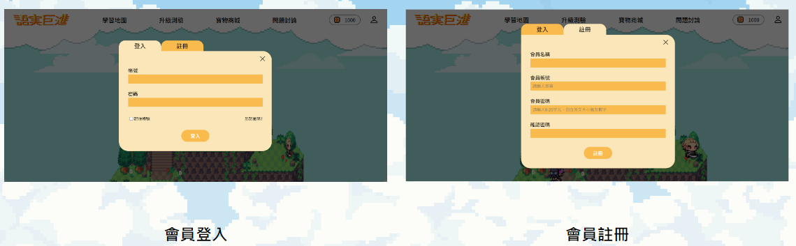
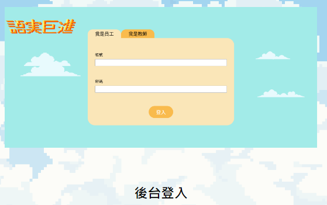
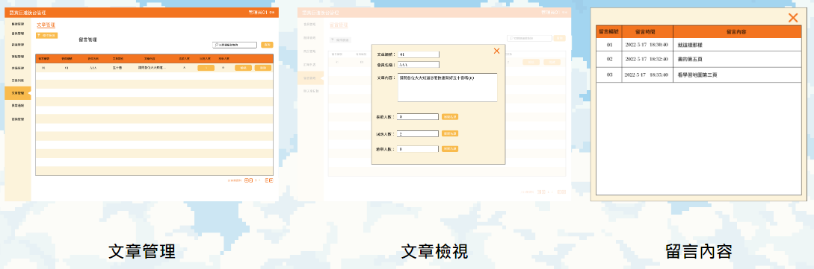

# 語時巨進

語時巨進是一個日文教學網站，提供所有學習日文的朋友一個線上教學互動網站。本網站採用關卡式讓使用者能從基礎的50音開始學習，透過破關來解鎖新的學習地圖，每次破關都可獲得代幣，使用者可使用代幣來購買NPC角色裝備和造型。另外，本網站還有提供線上論壇討論平台，讓所有使用者能在這個平台上討論分享學習心得互相交流，創造一個快樂學習的環境。

架站背景:2022/05-06，團體專題。

網址: https://tibamef2e.com/cgd101/g1/

 

## 緣起
本網站忠旨是為想學習日本語的人，打造輕鬆無壓力的學習環境，提供初階入門的日語內容，讓學員能有效吸收知識並建立信心，進而達到每日的扎實學習，以獲取巨大的進步效果。

 

## 使用技術
* 前端:
    - HTML
    - SASS
    - JavaScript
    - Vue.js
    - RWD 響應式設計

* 後端:
    - PHP
    
* 資料庫:
    - MySQL

* 自動化流程處理工具
    - gulp.js

* 版本控制工具
    - Git
    - Sourcetree

 

## 個人負責功能
* 前台
    - 導覽列切版
    - 信用卡付款切版
    - 問題討論: 
        - 前端切版 -> CSS grid system
        - Vue Component形式做功能渲染，Ajax(XHR),PHP做資料串接，完成發文和留言。同時根據使用者資料去篩選NPC圖片。
    - 會員登入/註冊: 採用JavaScript做帳號密碼驗證，Ajax(XHR),PHP串接資料至前台，完成登入/註冊。我們將登入的帳號密碼存入session，讓使用者不需要每次都輸入帳號密碼登入；相反地，登出就是將session資料刪除。註冊功能除了將使用者資訊寫入資料庫外，同時也將資料寫入session，讓使用者註冊完成後，直接登入到網站，即可開始操作。

* 後台
    - 後台切版
    - 管理員/教師登入功能:
        - 採用JavaScript做帳號驗證，Ajax(XHR),PHP串接資料至前台。
        - 不同的身分登入後台，會有不同的權限操做功能。
    - 文章管理: Vue, Ajax(XHR), PHP動態更新文章數量。

 

## 網站圖片

